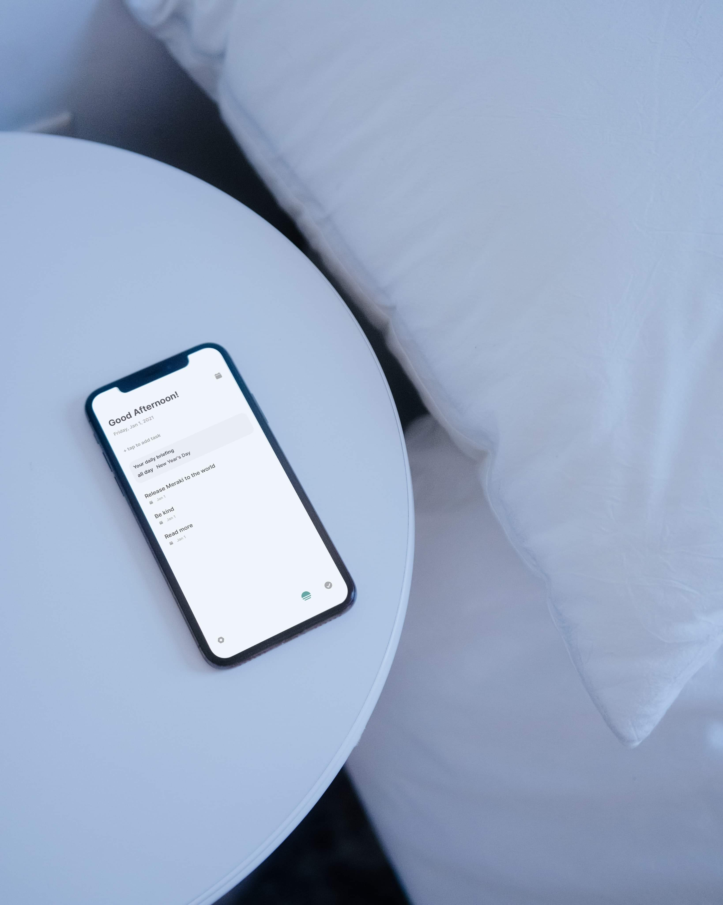
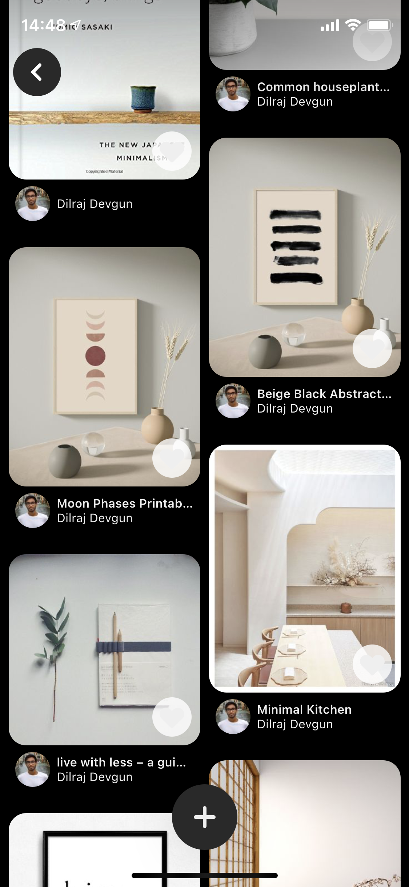
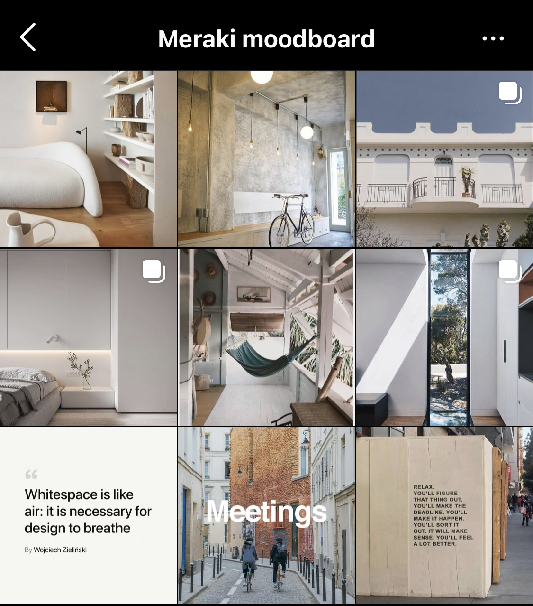
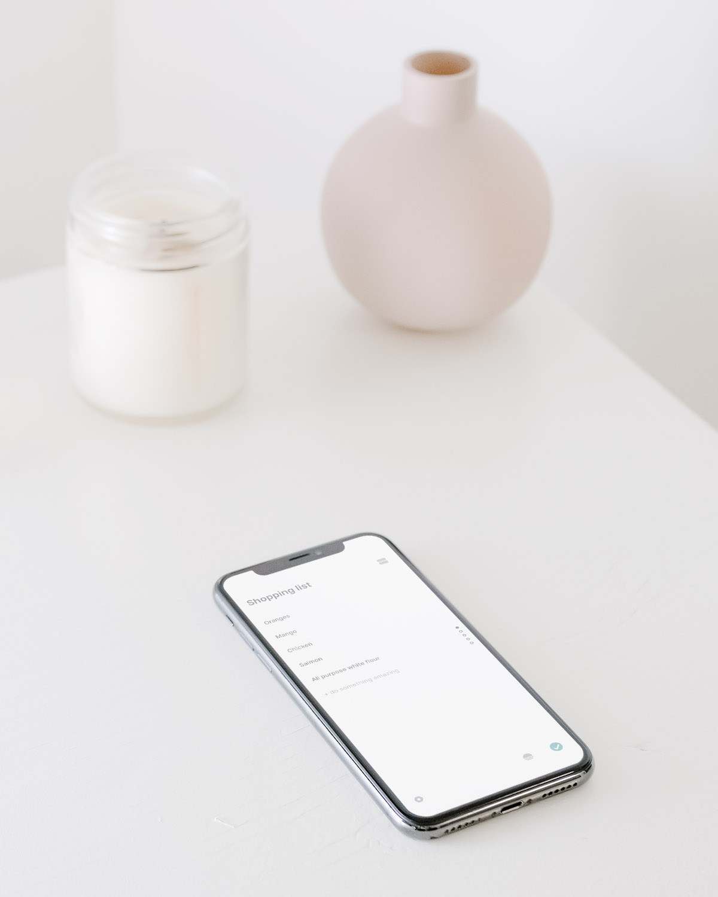

This week I released Meraki, the first app listed under my own name 🎉 . It's a versatile yet incredibly simple productivity tool that aims to help users focus better and be more mindful about approaching their work. 

Another todo list app? Do we really need another one in such a saturated space? I guess it wouldn't come as a surprise where I stand on this having just released one. 

I built Meraki as the todo list I wanted to use, having created a very basic version for myself during winter break in 2018. I used it for two years during college to keep track of my assignments, shopping lists, and things I needed to get done around my apartment. The app at the time only consisted of what you see in the lists page; the tasks, the page control to navigate between categories, and the date picker. 

I could have used any of the thousands of list apps on the store and I did for some time switching between different apps trying to find the right fit but for various reasons I couldn't find the one that worked for me. Out of the ones I tried some apps were quite simply bad and buggy they may have fit the minimalist style I was looking for but with more attention on style without much in the way of function. Others were overly complex with an abundance of options and configurations to tweak making adding a simple todo a task all in itself. There were also incredible apps like Todoist and Notion which were the gold standard for power-user's. I use Notion still for all my notes, documents, and planning its design is gorgeous, but for casual tasks it felt overkill. Todoist on the other hand had tasks that people could tweak and tailor to their exact needs, which required a time investment; I also wasn't the biggest fan of the design, while using it I found that my tasks would get lost in my lists. 

Meraki tries to meet in the middle, with the quality to be in the same league as Todoist and Notion, but targeting the casual user that want to be productive without much overhead. 

## Simple and Fast

The core principle is simple; present what's relevant and let everything exist without being intrusive. We don't want to hide things so much that its tedious to find, but we don't want to put everything front and centre such that it's overwhelming, its a balancing act that took multiple iterations to achieve.

Meraki sticks to the basics at its core; user's want various lists and todos.  There's no task specific page that shows all the configuration items like tags, labels, priority, and location. The information for a task is present right inline; the task item name and any reminder or scheduled date that may be set. If users haven't set one its, not there. 

Users add and edit tasks and category names right inline by tapping on them, without being taken out of the flow. The core options present themselves when users edit and disappear after. 

The Today page also follows this principle. The goals is to show user's what their day looks like, the calendar events, reminders, and scheduled tasks they have all in one place. All the other tasks user's might have are still present in their list, but don't bloat the app when looking at what needs to be done in the moment.

Adding tasks with the inbox is also built around this core principle, when opening the app its common to want to quickly jot down a tasks and deal with it later. Thats the purpose of the inbox and the ability to quickly add tasks on the Today page. Open the app, jot down a task, if you don't want to set a category it'll be put in the inbox and then carry on with what you're doing. I tried to remove as much friction as possible without compromising the experience. 

## Beautiful and Minimalist

> "Meraki is beautiful"
>
> "One of the best on the App Store. Wonderful UX great minimalism, very simple"
> 
> "I'll switch over to Meraki for the design factor alone"

This is some of the initial feedback I've gotten from users and testers and it makes me so happy. Part of my criteria when looking looking for a todo list app was something aesthetically pleasing and inviting. Todo lists should feel good to use, you don't want to open a task to see the work you have to do and feel discouraged, repulsed, or overwhelmed. The design and interaction was not an afterthought for Meraki it was one of the core driving forces behind the app.

From the opening animation that aims to relax the use as they enter the app to the colour themes I spent countless hours tweaking and making sure everything contributed to the feeling and emotion users feel while using the app. The design of the app itself could have an entire blog post dedicated to it, but I want to highlight some personal favourites here. 

Firstly, the inspiration. Interior decoration and physical space play an important part in my productivity and getting me in a mindset where I'm relaxed and excited to get to work. I love working in [new places that create a productive ambiance](https://thriveglobal.com/stories/the-science-behind-coffee-shop-productivity/); its an interesting phenomenon called [the 'coffee shop effect'](https://blog.trello.com/coffee-shop-effect-boosts-productivity). With COVID-19 especially many of us are stuck at home in the same place feeling trapped unable be where somewhere we can do our best work with passion. Meraki's design brings user's productive spaces into the digital world so its with them at all times inspiring and assisting them whenever they need. I aimed to make it a breath of fresh air. Below are the moodboards I created for Meraki and some final photos of the app. 

In addition to the colour two more stand out features for me are the options tray and page control navigation. The page control is almost like a fidget tool where I'm compelled to open the app and scroll through my categories because it feels good, but in the process I'm reminded of tasks that I have added in other categories I may not open often and this leads to less stale tasks. The options tray is also highly dynamic changing with the user's actions another application of the principle of showing details when necessary. 

## Future

I'm genuinely very proud of the product I've built but I'll admit there's a lot more develop to build this product out. My major priorities are to build an ecosystem of web, desktop, and android apps. I'm currently designing the architecture for the backend and devising a plan. While this is a more long term goal a few short term features are to improve the onboarding experience, add accessibility options for people who are colour blind and provide themes that they can enjoy. Furthermore I want to build a few widgets, add repeating options, and tweak some of the minor design elements around adding a task. 

In terms of long term monetization, my goal is to provide something for everyone. I do not believe in charging for the app or having to hide "pro" features behind a payment. My hope is that when there is an ecosystem built up users who want to take advantage of the whole Meraki suite can pay a subscription to enable syncing, however local use of the application and its features will remain free. 

Meraki is free to download now on the App Store [here](https://apps.apple.com/us/app/meraki-to-do-list/id1526181709). If you love it please share it and leave a review. Feel free to reach out with any suggestions for features or bugs you may have found.
